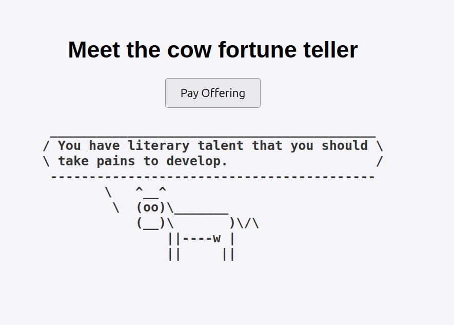
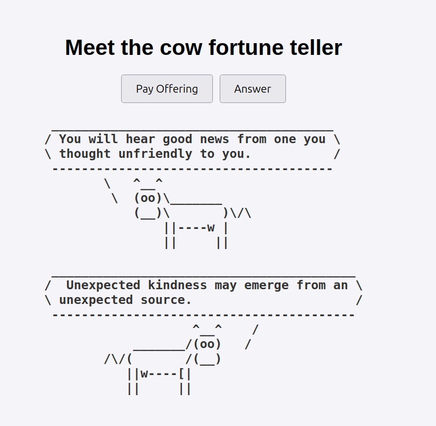

# Holy Cow
A cow fortune-teller app, build to learn abit about fastapi



## Using Docker
```sh
docker compose build
docker compose run
```

## Normal
```
python -m venv venv
source venv/bin/activate
pip install -r requirements
fastapi run main.py 
```

Also checkout the `responsive` version for AI response with ollama.


